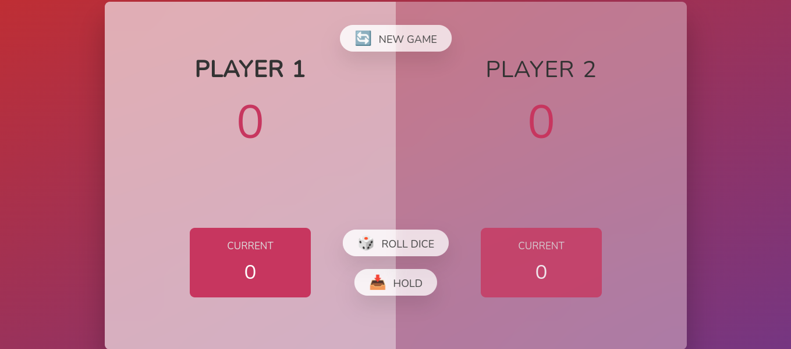
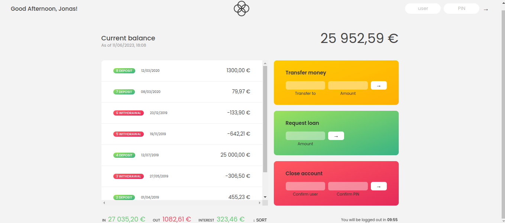
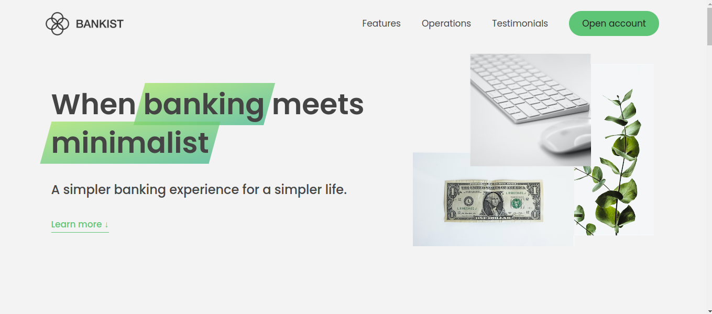
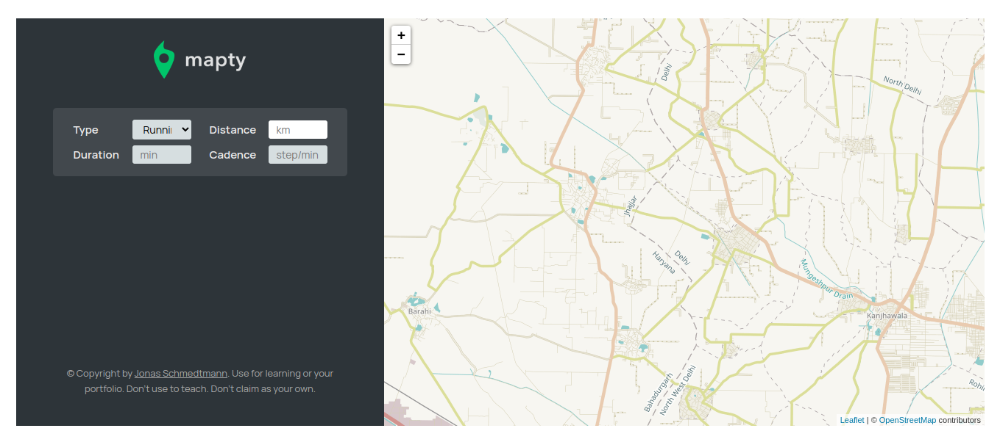
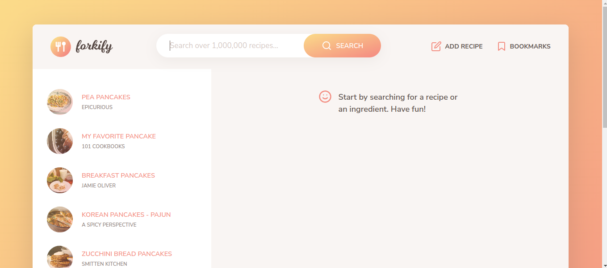

# Complete-Javascript-Course
This repository contains practice code, assignments, coding challenges, and resources of the course, exactly as shown in the videos.

## Projects made during this course:
- [Pig Game](https://pig-game-v2.netlify.app/) (DOM Manipulation)

 
- [Bankist](https://bankist.netlify.app/) (Arrays, Numbers, Dates, Timers. Fake "log in" with user js and PIN 1111)

- [Bankist Site](https://bankist-dom.netlify.app/) (Advanced DOM and Events)

- [Mapty](https://mapty.netlify.app/) (OOP, Geolocation, Project planning)

- [Forkify](https://forkify-v2.netlify.app/) (Final advanced project)

**The course is provided on Udemy click on _[this link](https://www.udemy.com/share/101Wfe3@8y5rkSipBu8cX_k5QYC0qBePr58tCkJWn4XKyODE1yCo60EZOjDghWnFgUvyU-P4PQ==/)._**

For assignments and coding challenges, refer to the folder of [Resources](https://github.com/jagmeetkaur03/Complete-Javascript-Course/tree/main/Resources) mentioned in the repo.
